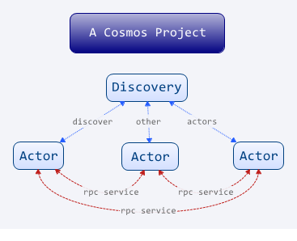

# cosmos

[](https://travis-ci.org/cosmosbox/cosmos)

cosmos是一个基于Actor的.Net分布式服务框架。

配合默认提供的各种组件(Components): 包括前端访问组件(Handler)等等实现诸如分布式游戏服务器, 分布式聊天服务器等应用.



## TODO: 快速入门:创建新项目

```shell

cosmos createproject ExampleProject
```

在安装好Visual Studio的机子上双击ExampleProject.sln文件。

点击运行...

## 简单项目举例: 分布式实时游戏(地图角色砍怪发技能)

TODO:

## 有什么类似的项目?

Dubbo

## cosmos是一个分布式应用开发管理器,但提供框架功能

她的设计初衷是游戏服务器框架，但它并不是一个游戏服务器开发框架......

她本质是一个服务框架.

她的核心只做一件事：启动你预先定义好的Actor结点，并且确保这些Actor结点可以互相通讯。

至于这个Actor结点做什么，她不管。

嗯，看来很玄的样子，接下用现实生活的故事作个类比吧。

## 说说麦当佬和震宫肤的分布式故事

从前有间叫麦当佬的餐厅，最初它只有一家很小的门店，后来为了容纳更多的人，把小小的门店扩大成大大的门店； 再后来，它发现一家大大的门店已经满足不到客人的需求了，开第二家、第三家；到现在，全世界开了几万家的门店，并且在这个过程中，它累积了这种世界各地分布式开店的管理经验，整理成一本《麦当佬分布式开店经验真经》，并以这个管理结构去继续开它的新店。

后来，有一家新开的震宫肤餐厅，生意红红火火，这时候它就开了第2家餐厅。老板发现，要管理好2家餐厅可不是一件容易的事：A分店要推出新品“辣椒豆浆”， 要怎么做，才能让B分店同时的推出“辣椒豆浆”呢？ 
这首先要解决这两家分店的通讯问题： A分店店长要和B分店店长互相熟悉，并且A分店要把方案、供货传递到B分店，

老板对这些并没有太多的经验，他在想，要是像麦当佬那样开30000家分店，同时要推出“辣椒豆浆”，要怎么解决这30000家分店的同步推产品问题？30000家分店要怎么做好管理？

震宫肤的老板居然明白不重复造轮子的道理，他决定Cosmos分布式特许经营管理咨询公司。


这家Cosmos分布式特许经营管理咨询公司，专门为各种特许加盟式企业出谋划策，制定分布式经营策略。它为客户提供一些分布式经营的策略：

* 规划分店： 规划好分店，分店的类型、地址、产品差异，是否需要设置旗舰店
* 启动分店： 装修、布置，开业！
* 互相发现： 分店实在太多了，这时候要确保所有店对其它分店都互相知晓。刚开始可以把所有分店印在纸巾袋上
* 分店通讯：所有的分店，都有一个内线电话； 比如A分店没有青瓜了，立刻拨通B分店的电话呼唤青瓜一箩！

Cosmos咨询公司为震宫肤餐厅出谋划策，但是，它并不参与具体业务，只提供管理框架。

震宫肤得自己招聘，自己进货，自己收银。看到Cosmos咨询公司如此牛掰，震宫肤老板希望Cosmos咨询公司能帮忙把装修改善点。

Cosmos咨询公司旗下有家分公司叫Cosmos.Component集团公司，集团属下有一家Cosmos装修子公司。正好把震宫肤的装修问题也解决了。
老板再请来Cosmos.Component集团旗下的Cosmos财务子公司，把融资的问题又解决了。

嗯，Cosmos麾下有很多业务子公司，供客户使用，但Cosmos自己本身只做分布式咨询管理。

这家Cosmos咨询公司，像极了本项目的架构。

PS: 如果你突然对麦当佬加盟店的管理兴趣盎然，可搜关键字“特许经营管理”

## 什么是Actor结点？

## 核心功能:
	* 工程：创建工程，定义好所有的Actor
	* 启动：启动某个或所有Actor
	* 发现：Actor之间会互相发现（通过文件或发现服务）
	* 通讯: Actor之间可以互相通讯(RPC)

除了以上功能，其余的一切都是附加组件、功能组件。


可能有点玄...什么意思？她有什么应用场景？

## 应用场景举例

### 分布式游戏服务器

### 运维管理工具

试想一下，现在叫你做这样的一件事：

** 给你1000台安装好Linux并可以随意SSH控制的主机，要求每台主机都要下载一个网络文件到根目录

1000台主机，不可能一台一台的进入并且执行命令。如果一个控制台可以控制所有的主机该多好啊？

这种分布式，用Actor来设计：

* 肉鸡Actor, 运行在这1000台Linux上
* 管理员Actor, 就运行在你自己的主机上吧, 向肉鸡Actor传递执行指令
 
 我们假设肉鸡Actor全部已经预先运行好，忽略怎么安装运行Actor的问题...


当然，现成的分布式运维工具类似Chef/Salt也是基于这种方式，并且已经做得很好，这里仅仅举例，没必要重新造轮子。

# 核心类库

- Cosmos 
	- Cosmos.Actor 核心组件
		- Cosmos.Rpc
	- Cosmos.Framework 开发框架组件
	- Cosmos.Framework.Components

## 特性

* 仿U3D的协程，功能更强
* 分布式，既可多进程也可多线程
* 嵌入Node.js(edge.js)，作为脚本语言、配置语言
* 程序集热更新(DLL)

## 第三方库

* NLog - 日志输出
* MsgPack - 序列化
* NetMQ - 网络库
* JSON.Net - JSON库
* NUnit - 单元测试


### 为什么使用了大量的第三方组件而不是重新实现

我觉得我见过很多的C++程序员嘴喜欢做的事情, 宁愿自己实现的一个蹩脚的实现,也不太信用使用别人的代码.
我建一座楼房,我们要材料: 要买砖,要买灰,要买钢筋,要买锤子. 你总不可能自己做砖头,自己切钢筋,自己炼锤子对吧~

基于这个概念,  我们要写一个应用程序, 我们没必要自己实现一个socket,自己实现一个队列, 就像买砖头买钢筋那样,挑好的货来用就行了.
如果买到的一个次品的砖头怎么办? 换一个牌子的.


# 其它


## 跟Dubbo很像?
Cosmos的灵感来源于游戏服务器框架Pomelo, 在设计之初并没有参考Dubbo. 后来才知道跟Dubbo架构非常相像
* Dubbo的Provider 对应 Cosmos.Actor
* Dubbo的Registry 对应 Cosmos.Actor的Discovery
* Dubbo的Remoting 对应 Cosmos.Rpc
* Dubbo的Consumer和Providoer需要Xml配置, interface调用;  Cosmos.Rpc使用字符串反射调用,免配置
* Cosmos没有提供Monitor

## 为什么使用C#，而不是Go,NodeJS,Python？
Cosmos的灵感源于游戏开发框架Pomelo。在设计之初，
Cosmos使用Go、NodeJS、Python三种语言都分别尝试过，最终选择C#，主要出于以下几点考虑：

### C#能非常好地进行调试

Visual Studio确实是地球上最好的IDE，你可以用它条件断点，可以使用NUnit等方便地进行单元测试。即使是一个庞大的项目，找出一个深层次的BUG并不难，而且，你也不用担心它会因某个struct越界引发内存崩溃（C/C++）。

相信有经验的开发人员都深有这样的体会，脚本语言开发效率虽高，但当项目到达一定的规模后，调错对开发人员可谓痛不欲生。尤其是一些没有准备单元测试的开发项目，出BUG了，只有这边输出一个Log，那边输出一个Log，花上一整天下来上百上千次地用Log调试错误。虽然现在有很多脚本语言都能断点调试，但如NodeJS这样的异步IO模型，有时候，程序之间巨大的跳跃性让人要找BUG十分的抓狂。

举例，我以往参与的一个游戏服务器项目使用Lua脚本语言，当某角色35级做某个任务出现BUG后，怎么办？ 重启游戏，登录注册，打怪，升到35级，做这个任务，埋点Log，调试，没找到问题；再埋点，再重启，调试，没找到问题；再埋点，再重启，再调试......无数次这样的调试循环后，结果是：加班。

### C#的异步模型灵活好用

语言的异步模型是Cosmos设计之初最最最最重要的考量，现今这个年代，能否轻松愉快的异步编程实在太重要了。

.Net Framework 4.5，async/await的加入使多线程编程一下子容易了起来。
有Unity经验的人知道，Unity的Coroutine协程是有多么的好用；async/await就是用协程的方式来做多线程。Cosmos.Tool中也模仿Unity Courinte实现了一套简单的Cosmos Coroutine供使用。

我坚信像协程这种顺序形式的异步编程时最具可读性的异步模型。

类似C# async/await的还有Python 3.4加入asyncio，这个也是Cosmos最初使用Python试验的重要类库。但是因为配套的第三方类库不多，后来没有考虑了。

Go语言的gocoroutine可以说是最先进的异步编程模型，开发者无需理会是线程还是协程，它都封装好了。考虑到它的学习曲线和面向受众少。

至于NodeJS的异步模型就不多说 —— callback hell。 尽管Promise的使用会大大减弱这个影响，但Promise对小白来说可不那么容易理解。

最终Cosmos选择了C#，进程、线程、协程相结合： 一个Actor的本质就是独立一个线程，也可以通过一个新进程去启动一个Actor线程，网络的调用大多使用async/await。

### C#/.Net程序员很多
学校里教得最多的计算机语言是啥？ C、C++、Java、C#。 全世界都一样。

### 开源、有无数商业公司验证过
上面也提到了C#/.Net程序员多，为什么多？它的靠山可以微软大财团。Java和.Net可谓绝大部分企业应用的两大阵营，为什么？稳定、用的人多、提供商业支持。

并且，如今的.Net开源了，势头强劲，大有统一全平台的趋势——Windows平台有官方.Net, Unix/Linux有Mono，Android/IOS有Xamarin，游戏引擎有Unity、MonoGame。

### 跟Unity3D很好的配合

Unity3D使用Mono引擎，自然而然C#就是它最佳的编程脚本。如果一个网络游戏，服务器客户端都使用同一种语言，那么就能享受共享类库（如共享配置类、网络数据类、业务逻辑类）的巨大便捷了。


# TODO List

* Components.RunnerActor - for run a new actor in thread
* Components.MonitorActor